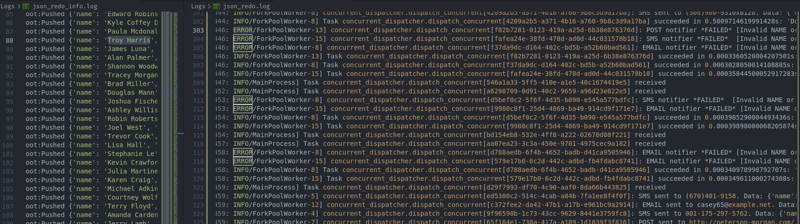

# UNICC-[Programming Challenge] JSON REDO 

<!-- Setup and Run -->
### Setup and Run :rocket:

```bash
# From the project's root dir 
# [for Linux].

# Dependencies,
# Python >= 3.7, docker (or redis) installed.

# Virtual env to avoid conflicts w existing dependencies.
python3 -m venv env
source env/bin/activate

pip install --no-cache-dir -r requirements.txt 

# Broker for Celery
docker run -d -p 6379:6379 redis

python concurrent_dispatcher

# Starting the celery app.
# [Option-1] With logging into file
mkdir Logs && touch Logs/json_redo.log
celery -A concurrent_dispatcher  worker --loglevel=INFO -O fair -c 16 -f Logs/json_redo.log
# [Option-2] With loggin into stdout
celery -A concurrent_dispatcher  worker --loglevel=INFO -O fair -c 16 

# In a new terminal, from project root dir.
python main.py

# This process can be automated with docker-compose, do let me know, I'll be happy to write one :).
```
    
<hr>    

## Implementation description

<hr>

### 1. Solving - "Finally, you need to assume that the JSON file can have thousands or millions of entries."    

I draw 2 conclusions from this provide assumption.  
- *JSON file needs to be parsed lazily through generator to avoid out of memory scenario*
  - > Used ijson for handling this, here 📎 [main.py](./main.py)
  
- *Notifying million users sequentially will take ages, hence concurreny is a must.*
  - > Used Celery as task queue manager (broker=redis) for handling concurrency.  📎 [concurrent_dispatcher.py](./concurrent_dispatcher.py)

  - > ### NOTE on celery.
    > - Celery with maximum concurrent worker nodes set to 16.
    > - Main loop calls for notifier *asyncrhonously* and #requests to [concurrent_dispatcher](./concurrent_dispatcher.py) will be >16 in a fraction of second, but that's not an issue, sicne Celery persists state and will add the job to queue untill one of the worker node is free.
    > - Documentation suggests to avoid going beyond 2x of machine's actual cores.
<hr>

<!-- UML Class diagam -->
### 2. Model design pattern (UML class diagram)

*_Factory design pattern_* 

Interface [NotifierInterface](./Models/Interface/notif_interface.py) for creating objects in superclass [notif_factory.py](./Models/Factory/notif_factory.py), but allows subclasses ([EmailNotifierFactory](./Models/ConcreteFactory/email_notif_factory.py), [SmsNotifierFactory](./Models/ConcreteFactory/sms_notif_factory.py), [PostNotifierFactory](./Models/ConcreteFactory/post_notif_factory.py)) to alter the type of objects that will be created.  


> ### Advantage of using factory patern here.
> - Atomicity and thus *custom exceptions* for every type of notification (Data validation).
> - If a new notification medium (Or new addition to Model) is to be integrated, it can be done in two easy steps with '0' changes to client code.
 >   - Creatre  the corresponding entry into /ConcreteFactory/ dir, inherit NotifierFactory and override 'factory_method()'
 >   - Secondly, inherit the NotifierInterface and implement the abstract method.
> - Separates product construction code from the code that actually uses the product. Thus flexibility for extending.

 Just like that new services can be integrated, without having to break the current client code.

#### Reason for Factory design pattern, 
- Clearly the pending notifications are of three different types, SMS, EMAIL, and POST. 

- Logically only different variants of Notifiers, and *(assumption)* probably future work would involve more variants (App Notifier or Call Notifier).  

- Hence Factory pattern fits best for unified operations, and easy to read/mantain code, and support for integration of new Notifier variants wihtout breaking client code. 
  
<hr>

    
### 3. Data validation
- With factory design pattern implementation I have created separate factory generators which provide sperate implementations for [EmailNotifierFactory](./Models/ConcreteFactory/email_notif_factory.py), [SmsNotifierFactory](./Models/ConcreteFactory/sms_notif_factory.py), [PostNotifierFactory](./Models/ConcreteFactory/post_notif_factory.py)  
  
- Each class has its own unique validation() defined in [EmailNotifier](./Models/Product/email_notif.py), [SmsNotifier](./Models/Product/sms_notif.py), [PostNotifier](./Models/Product/post_notif.py) and validates data and checks for null. (Applied REGEX to check email format in email validation.)
- ** __NOTE: Ensured data validation by declaring it as abstract method in [NotifierInterface](./Models/Interface/notif_interface.py) and hence, a factory variant CANNOT be instantited unless it implements validation()__
  
<hr>

### 4. Exception handling
- Defined custom exceptions [InvalidEmailReq](./Exceptions/invalid_email_req.py), [InvalidSmsReq](./Exceptions/invalid_sms_req.py), [InvalidPostReq](./Exceptions/invalid_post_req.py), which is raised against detection of invalid data. 
- Added exception handling in various other places wherever seemed meaningful, might have missed some, do let me know please. :)
  
<hr>

### 5. Unit-testing
* Implemented for 
  - <1> Dispatcher {[test_dispatcher](./test_dispatcher.py)} response (Log returned after sending mock sms, email, POST), and 
  - <2> Factory object instantiation {[test_object_model](./test_object_model.py)} (This was necessary as factory generator uses covariant return type to give specific variant, hence an unittest.assertIsInstance check for the same.)
  - <3> Integration for EndToEnd test requires mocking [test_end_to_end.py](./test_end_to_end.py), my approach is to patch with fake JSON data so unittesting can be done without depending on network req. I would have written it down, but I may require some extra time for that piece.    
    -  [__For now, test_dispatcher does sort of end-to-end test, by skipping the lazy JSON loader__]
  
<hr>

### 6. Logging
* Logs INFO, DEBUG and WARN for every instance of successful or failed notification into log files.
* Used celery logger, which can log into file or terminal (Described in #SetupAndRun section)
* >  [json_redo_info.log](./Logs/json_redo_info.log), [json_redo.log](./Logs/json_redo.log)
  > 

<hr>

### 7. Fail safe
* Every notification pushed is susceptible to failure due to some 'Recoverable error'
* This application is fail safe, RETRIES set to max=5 upon failure. Defined here, [concurrent_dispatcher.py](./concurrent_dispatcher.py)
* Defined a custom dummy exception to mimic a recoverable error [some_recoverable_error.py](./Exceptions/some_recoverable_error.py)

<hr>

## EOF, Thank you :)