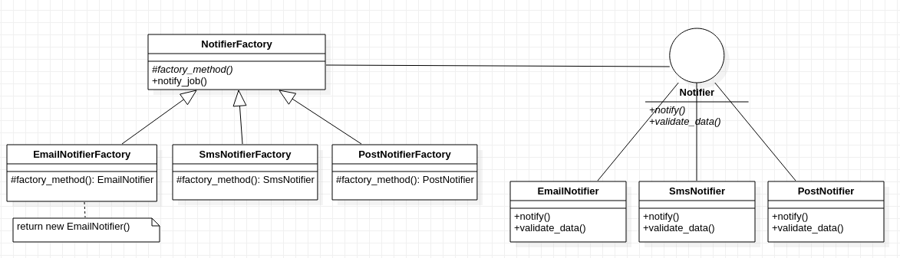

# UNICC-JsonRedo

<!-- UML Class diagam -->
### Design Pattern

Implemented Factory design pattern to make the data model robust, extensible and easy to work with.
Created an Interface 'NotifierInterface' in python which is used through out the Models to provide Factory design.
If a new notification medium is to be integrated, it can be done in two easy steps.
  - Creatre  the corresponding entry into /ConcreteFactory/ dir, inherit NotifierFactory and override 'factory_method()'
  - Secondly, inherit the NotifierInterface and implement the abstract method.

 Just like that new services can be integrated, without having to break the current client code.

 ### Reason for Factory design pattern, 
 Clearly the pending notifications are of three different types, SMS, EMAIL, and POST. 
Logically different variants of Notifiers, and probably future work would involve more variants (App Notifier or Call Notifier), hence Factory pattern fits best for unified operations, and easy to read/mantain code. 
